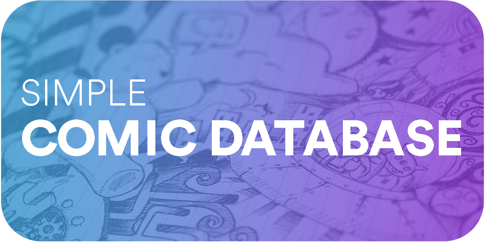
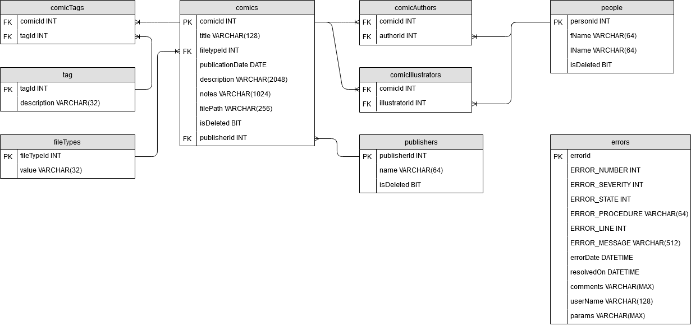

## Overview
This is the repository for the development of a comic book database project using MSSQL 2019 for [CSE 385 Database Systems](https://www.miamioh.edu/cec/academics/departments/cse/academics/course-descriptions/cse-385/index.html). There are three main components to the project: [create_comics.sql](create_comics.sql), [populate_comics.sql](populate_comics.sql), and [test_comics.sql](test_comics.sql). create_comics.sql creates the tables and stored procedures, populate_comics.sql populates the database with data, and test_comics.sql tests the database accordingly.

## Entity Relationship Diagram

## Stored Procedures
- spSave_Error
  - Saves an error to the database.

- spAddUpdateDeleteTag
  - Adds/Updates/Deletes a tag to/from the database.

- spAddUpdateDeleteFileType
  - Adds/Updates/Deletes a file type to/from the database.

- spAddUpdateDeletePublisher
  - Adds/Updates/Deletes a publisher to/from the database.

- spHardDeletePublisher
  - Hard deletes a publisher to/from the database.

- spAddUpdateDeletePerson
  - Adds/Updates/Deletes a person to/from the database.

- spHardDeletePerson
  - Hard deletes a person to/from the database.

- spAddUpdateDeleteComic
  - Adds/Updates/Deletes a comic to/from the database.

- spHardDeleteComic
  - Hard deletes a comic to/from the database.

- spAddDeleteComicAuthor
  - Adds/Updates/Deletes a comic author to/from the database.

- spAddDeleteComicIllustrator
  - Adds/Updates/Deletes a comic illustrator to/from the database

- spAddDeleteComicTag
  - Adds/Updates/Deletes a comic tag to/from the database.

- spGetComics
  - Gets a list of all comics from the database.

- spGetComicById
  - Gets a list of all comics from the database by id.

- spGetComicByTitle
  - Gets a list of all comics from the database by title.

- spGetComicByTag
  - Gets a list of all comics from the database by tag.

- spGetComicByAuthor
  - Gets a list of all comics from the database by author.

- spGetComicByIllustrator
  - Gets a list of all comics from the database by illustrator.

- spGetComicByPublisher
  - Gets a list of all comics from the database by publisher.

- spGetComicByFileType
  - Gets a list of all comics from the database by fileType.

- spGetPeople
  - Gets a list of all people from the database.

- spGetPeopleById
  - Gets a list of all people from the database by id.

- spGetPeopleByName
  - Gets a list of all people from the database by name.

- spGetPublishers
  - Gets a list of all publishers from the database.

- spGetPublishersById
  - Gets a list of all publishers from the database by id.

- spGetPublishersByName
  - Gets a list of all publishers from the database by name.

- spGetComicAuthors
  - Gets a list of all comic authors from the database.

- spGetComicIllustrator
  - Gets a list of all comic illustrators from the database.

- spGetTags
  - Gets a list of all tags from the database.

- spGetTagsByComic
  - Gets a list of all tags from the database of a specific comic.

## License

